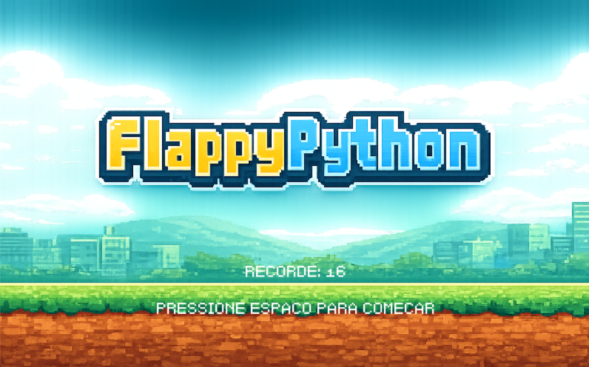
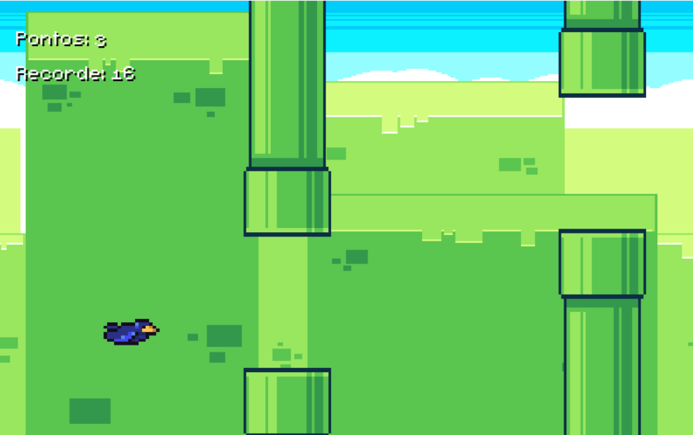
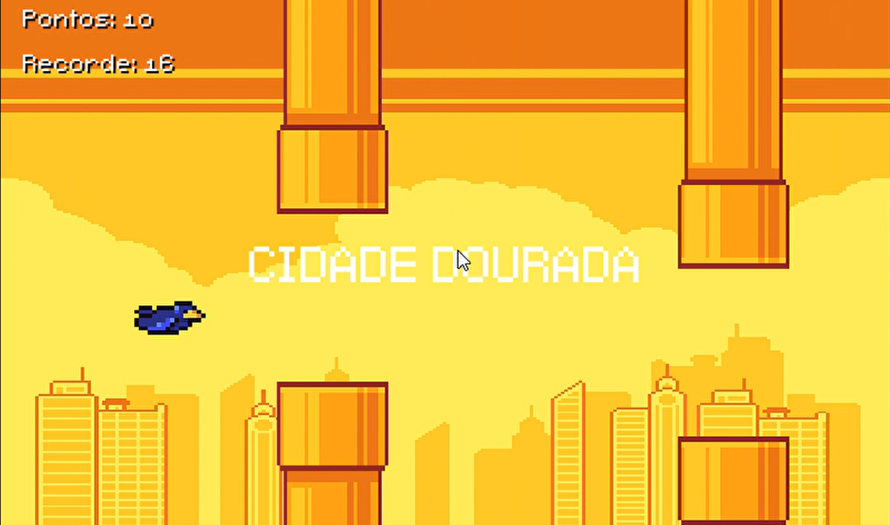

# Flappy Python

Projeto final da disciplina de Introdução a Algoritmos/Programação, desenvolvido utilizando Python e a biblioteca Pygame.



## Integrantes do Grupo

* Gabriel Sousa Aguiar
* Nelson Buralli Dabes
* Rafael Mota Azevedo
* Yudy Samuell Ramos

## Estrutura do Projeto

* `main.py`: ponto de entrada da aplicação.
* `src/`: código-fonte principal do jogo (loop, regras, lógica e dados).
* `assets/`: imagens, fontes e sons.
* `data/`: arquivos persistentes (recorde).
* `tests/`: testes unitários com Pytest.
* `docs/`: documentação do projeto.

## Descrição do Jogo

O Flappy Python é um jogo inspirado no clássico Flappy Bird. O jogador controla um pássaro que deve atravessar espaços entre obstáculos sem colidir com eles.

Durante a partida, o jogador acumula pontos, avança por diferentes cenários e tenta alcançar a pontuação necessária para completar todas as fases do jogo.

## Objetivo do Jogador

Controlar o pássaro utilizando a tecla Espaço para evitar colisões com os obstáculos, alcançar a maior pontuação possível e completar todas as cidades do jogo.

## Regras do Jogo

* O pássaro é afetado pela gravidade e cai constantemente.
* Ao pressionar a tecla Espaço, o pássaro sobe.
* Obstáculos são gerados periodicamente e se movem da direita para a esquerda.
* O jogador ganha pontos ao ultrapassar os obstáculos.
* O jogo possui diferentes cenários desbloqueados conforme a pontuação.
* O jogador vence ao atingir 50 pontos.
* O jogo termina quando ocorre colisão com um obstáculo, com o teto ou com o chão.
* O recorde é salvo em arquivo para utilização em partidas futuras.

## Controles

* Espaço: iniciar partida.
* Espaço: fazer o pássaro subir.
* Espaço após derrota ou vitória: reiniciar a partida.
* Fechar a janela: encerrar o jogo.

## Estruturas de Dados Utilizadas

O projeto utiliza:

* Listas para armazenar os obstáculos ativos na tela.
* Dicionários para armazenar os dados do pássaro, fases e obstáculos.
* Arquivos para salvar e carregar o recorde do jogador.

## Funcionalidades Implementadas

* Sistema de pontuação.
* Sistema de recorde persistente.
* Sistema de fases.
* Mudança de cenários.
* Tela inicial.
* Tela de vitória.
* Tela de Game Over.
* Música de menu.
* Música durante a partida.
* Efeitos sonoros.
* Geração automática de obstáculos.
* Detecção de colisão.
* Reinício da partida.
* Testes básicos de lógica.

## Como Executar o Projeto

### 1. Clonar o repositório

```bash
git clone LINK_DO_REPOSITORIO
cd NOME_DA_PASTA
```

### 2. Instalar dependências

```bash
pip install -r requirements.txt
```

### 3. Executar o jogo

```bash
python main.py
```

## Como Executar os Testes

```bash
python -m pytest
```

## Testes Implementados

Os testes verificam o funcionamento da lógica de atualização do recorde, cobrindo os seguintes cenários:

* Pontuação maior que o recorde.
* Pontuação menor que o recorde.
* Pontuação igual ao recorde.

## Conceitos da Disciplina Utilizados

* Variáveis.
* Estruturas condicionais.
* Estruturas de repetição.
* Funções.
* Modularização.
* Listas.
* Dicionários.
* Manipulação de arquivos.
* Testes automatizados.
* Organização de código.

## Recursos Utilizados

### Imagens
* Pássaro: https://ma9ici4n.itch.io/pixel-art-bird-16x16
* Background e canos: https://megacrash.itch.io/flappy-bird-assets

### Sons e músicas
* Game Over: https://freesound.org/people/LilMati/sounds/435194/
* Jump: https://freesound.org/people/cabled_mess/sounds/350906/
* Pixabay Music e Freesound (Para as músicas do menu e do jogo, ambas são gratis)

### Fonte

* FS Pixel Sans: https://www.1001fonts.com/fs-pixel-sans-unicode-regular-font.html

### Biblioteca

* Pygame: https://www.pygame.org/download.shtml

## Checklist dos Requisitos

* Jogo executável.
* README atualizado.
* Proposta preenchida.
* Testes implementados.
* Utilização de listas e dicionários.
* Leitura e escrita de arquivos.
* Estrutura modularizada em múltiplos arquivos.
* Sistema de pontuação.
* Condição de vitória e derrota.

## Capturas de Tela

### Tela Inicial


### Gameplay




